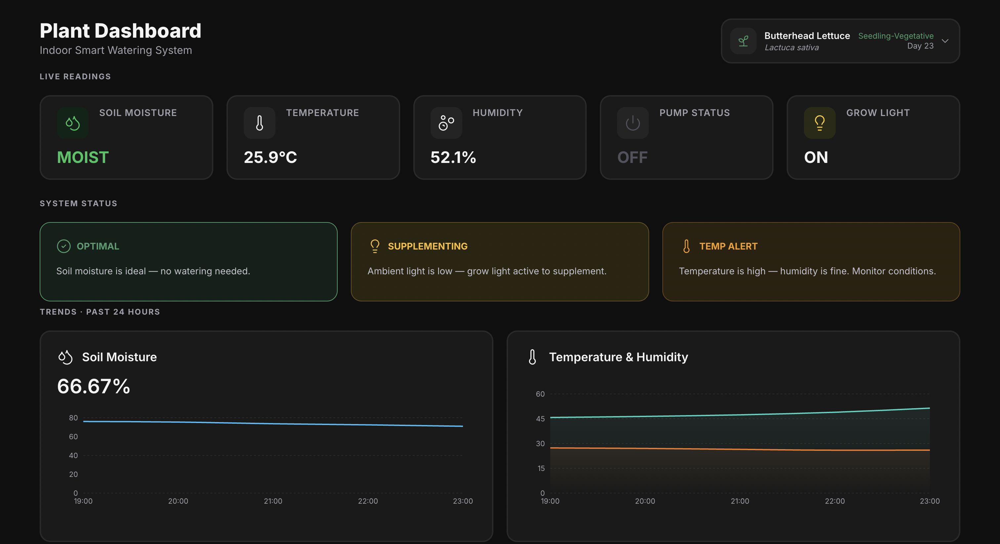

# 🌱 Plant Monitor — Dashboard

**A full-stack dashboard for an IoT plant monitoring system, built to keep a single head of butterhead lettuce alive with code.**

This is the web and cloud half of a two-part system. It receives live telemetry from an Arduino-based device, stores it, and surfaces it on a real-time dashboard that shows not just *what* the plant's conditions are, but *what the system is deciding and why*.

🔗 **Live demo:** [plant-monitor-dashboard-v2.vercel.app](https://plant-monitor-dashboard-v2.vercel.app)
🔧 **Firmware repo (the other half):** [plant-monitor-firmware-v2](https://github.com/smithalexandre05/plant-monitor-firmware-v2)

---



---

## Overview

Most plant-monitoring dashboards show you numbers. A soil reading of `512` means nothing to a person, so this project focuses as much on **interpreting** the data as collecting it.

The dashboard pulls live sensor data from a physical device caring for a butterhead lettuce plant, then presents it in three layers: at-a-glance system decisions ("watering is holding — soil is fine"), current live readings, and 24-hour trends. The result is an interface that reads less like a data dump and more like a system explaining itself.

It was built as a deliberate learning project — a way to work across the entire stack, from a sensor on a windowsill to a live web app, and to understand every layer by building it rather than reading about it.

## Features

- **Live sensor readings** — soil moisture, temperature, humidity, pump status, and grow-light status, polled in real time
- **Decision narratives** — the system translates raw state into plain-language reasoning (e.g. *OPTIMAL — soil moisture is ideal, no watering needed*; *TEMP ALERT — temperature is high for this growth stage*)
- **24-hour trend charts** — soil moisture, temperature, and humidity over time, with server-side hourly aggregation
- **Growth-stage awareness** — thresholds (light window, ideal temperature/humidity) are tuned to the plant's current growth stage, surfaced in the interface
- **Actuator history** — tracks grow-light run time and pump activations over the day
- **Fully responsive dark-mode UI**

## Tech Stack

| Layer | Technology |
|-------|-----------|
| Framework | Next.js 16 (App Router) |
| UI | React 19 |
| Styling | Tailwind CSS v4 |
| Charts | Recharts 3 |
| Icons | Lucide React |
| API | Next.js Route Handlers |
| Database | MongoDB (Atlas) via the official `mongodb` driver |
| Hosting | Vercel |

## Architecture

This dashboard is one half of a system that spans hardware to cloud:

```
Plant + Sensors → Arduino (firmware) → API (Next.js) → MongoDB → Dashboard (React)
```

- The **firmware** ([separate repo](https://github.com/smithalexandre05/plant-monitor-firmware-v2)) reads the sensors and sends telemetry over HTTPS every 30 seconds.
- The **API routes** receive the telemetry, store raw readings in MongoDB, and expose endpoints for the latest reading, historical aggregates, and actuator history.
- The **dashboard** polls those endpoints and renders live readings, decision narratives, and trend charts.

Data is stored raw and transformed on read, so calibration and interpretation can change without losing or corrupting the underlying record.

## Getting Started

> **Note:** This dashboard is designed to pair with the [firmware device](https://github.com/smithalexandre05/plant-monitor-firmware-v2), but it will run on its own — it simply won't have live data without a device (or seeded data) posting to it.

### Prerequisites
- Node.js 20+
- A MongoDB database (e.g. a free MongoDB Atlas cluster)

### Installation

```bash
# Clone the repo
git clone https://github.com/smithalexandre05/plant-monitor-dashboard-v2.git
cd plant-monitor-dashboard-v2

# Install dependencies
npm install
```

### Environment variables

Create a `.env.local` file in the project root:

```
MONGODB_URI=your_mongodb_connection_string
```

### Run

```bash
npm run dev
```

Open [http://localhost:3000](http://localhost:3000) to view the dashboard.

## What I Learned

A few of the more interesting problems this project surfaced:

**Catching an event shorter than the sample rate.** The water pump fires for only ~500ms, but the device reports every 30 seconds — so sampling the pump's instantaneous state almost never caught it running. The fix was to stop treating the pump as a *state* to sample and start treating it as an *event* to record: a dedicated activation flag is set when the pump fires and only cleared after a successful upload, so no watering event is ever missed, even if a network request fails.

**Making data mean something.** Raw sensor values aren't useful to a person. A large part of this project was deciding *what the dashboard should say*, not just what it should show — designing decision panels that combine multiple inputs (soil state, cooldown timing, light levels, growth stage) into a single plain-language conclusion about what the system is doing and why.

**Keeping the browser fast.** A day of readings is thousands of data points — far too many to plot directly. Rather than shipping all of them to the browser, the trend charts are backed by a MongoDB aggregation pipeline that groups readings into hourly averages server-side, so the client receives a couple dozen points instead of thousands.

## Related

- 🔧 [Firmware repository](https://github.com/smithalexandre05/plant-monitor-firmware-v2) — the Arduino/C++ device that senses the plant and sends the data

---

*Built by [Alex Smith](https://github.com/smithalexandre05).*
